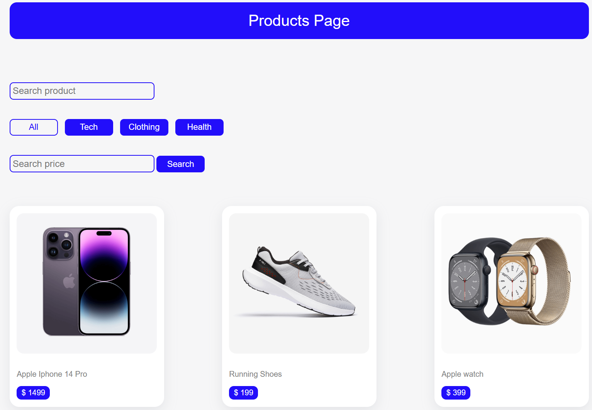
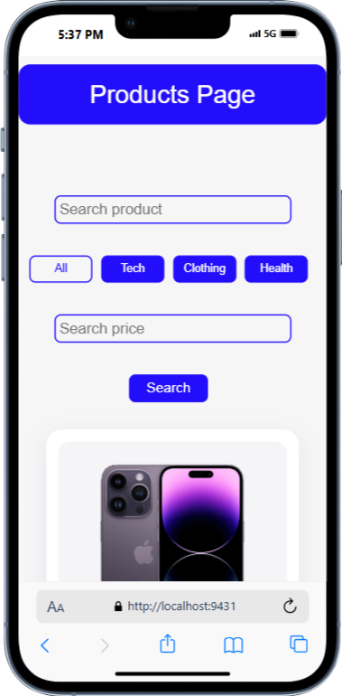

# JS Product Page Project

## Description
This is a simple JavaScript-based product page that allows users to search and filter products by category and price. The project includes HTML, CSS, and JavaScript to create an interactive and user-friendly shopping experience.

## Features
- **Search Functionality**: Users can search for products by name.
- **Category Filters**: Filter products by category (Tech, Clothing, Health, or All).
- **Price Search**: Search for products by exact price.
- **Responsive Design**: Optimized for different screen sizes.

## Technologies Used
- HTML
- CSS
- JavaScript

## File Structure
```
├── css/
│   ├── style.css
├── img/
│   ├── (Product images)
├── js/
│   ├── app.js
├── index.html
├── README.md
```

## Installation & Usage
1. Clone the repository:
   ```sh
   git clone https://github.com/rezasalimi01/js-product-page.git
   ```
2. Navigate to the project directory:
   ```sh
   cd js-product-page
   ```
3. Open `index.html` in your browser.

## How It Works
1. **Search for Products**: Enter a product name in the search bar to filter results.
2. **Filter by Category**: Click on a category button to display relevant products.
3. **Search by Price**: Enter a price and click "Search" to find products at that price.

## Screenshots
<div style="display: flex; gap: 20px; flex-wrap: wrap">
  
  
</div>

## Future Enhancements
- Add an "Add to Cart" functionality.
- Implement a backend for storing products.
- Improve UI with animations.

## Author
Developed by Reza Salimi
Feel free to connect!

---
### Happy Coding! 🚀

